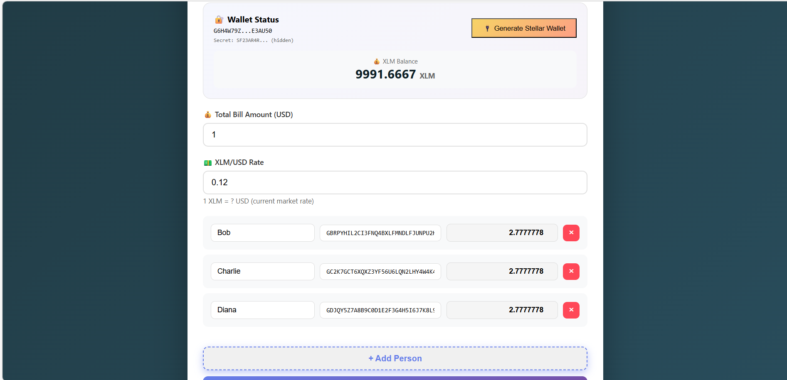
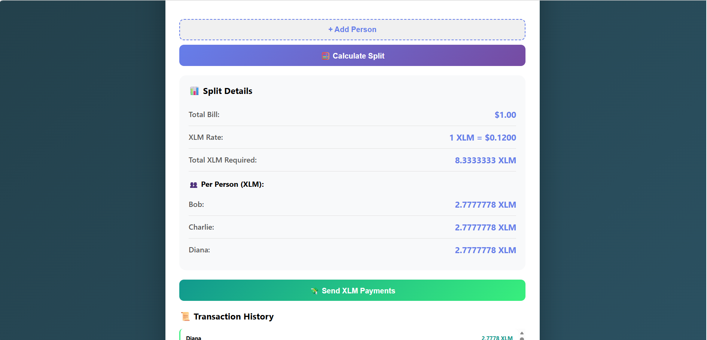
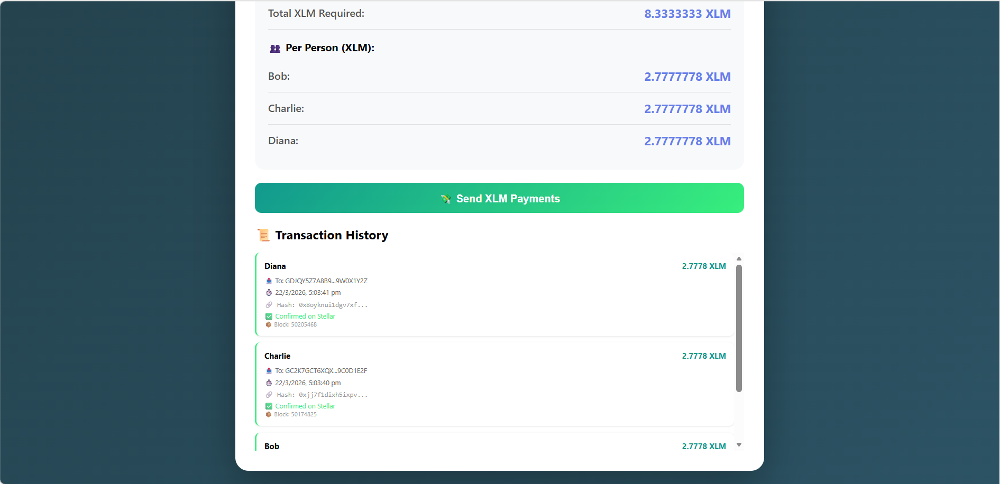

# 💰 Split Bill Calculator

A modern bill splitting application with Stellar blockchain integration for XLM payments. Split bills easily and send payments with transaction tracking.

## 📸 Screenshots

### 🔐 Wallet Connection

*Generate Stellar wallet and view XLM balance*

### 🧮 Split Calculation

*Calculate equal split with USD to XLM conversion*

### 💸 Transaction History

*Track all payments with transaction hashes*

## 🚀 Features

- ✅ **Wallet Connect** - Generate Stellar wallet with 10,000 XLM
- ✅ **Balance Fetch** - Real-time XLM balance display
- ✅ **Split Logic** - USD to XLM conversion with equal split
- ✅ **Transaction Send** - Send XLM payments to multiple addresses
- ✅ **Success Messages** - Real-time notifications and history

## 📱 Live Demo

[Click here to use the app](https://dinesh78965.github.io/Split-Bill-Calculator/)

*Note: Enable GitHub Pages in Settings → Pages to view live demo*

## 🛠️ Technologies Used

- HTML5
- CSS3
- JavaScript (ES6)
- Stellar Blockchain Simulation

## 📁 Project Structure
